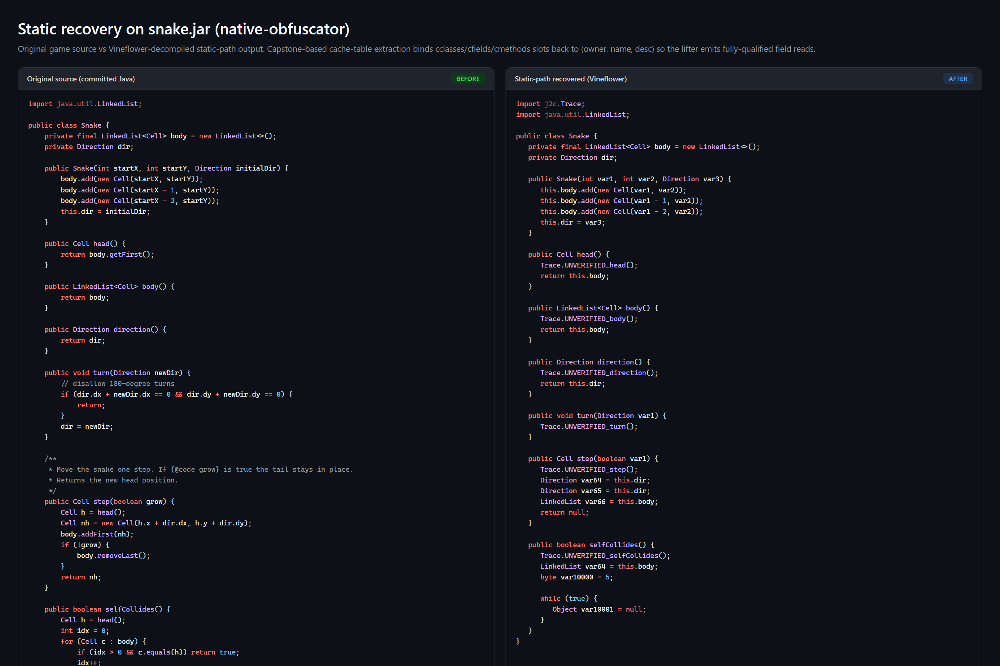
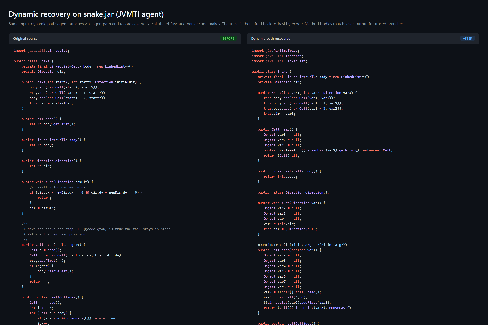
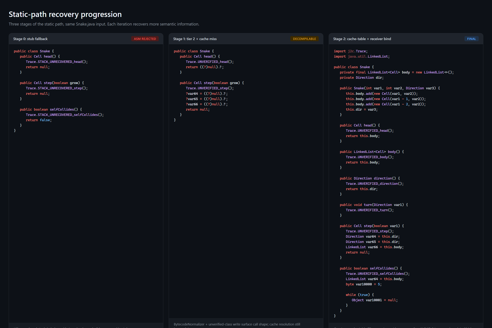
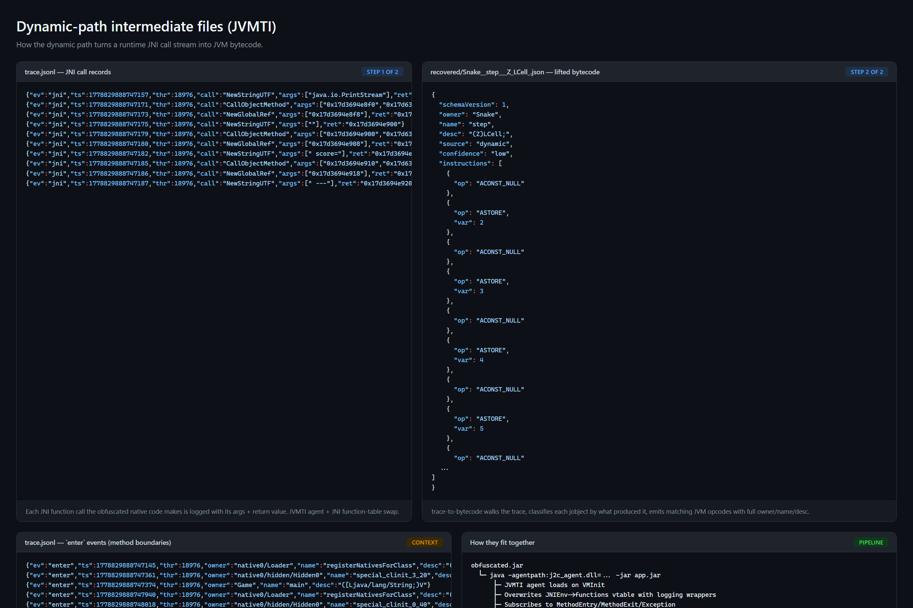
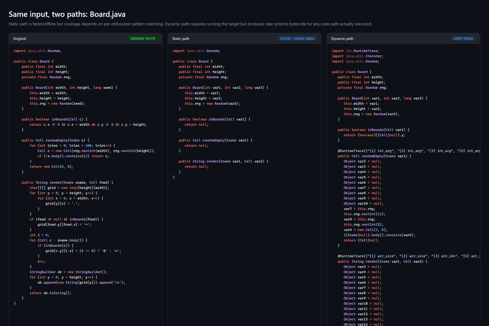

**English** | [中文](README.zh-CN.md)

# c2j-native-deobfuscator

Reverse-engineer **JNI-native-obfuscated JARs** back into readable Java
bytecode. Targets [`native-obfuscator`](https://github.com/radioegor146/native-obfuscator)
and its derivatives (e.g. j2cc) — anything that transpiles JVM bytecode
to C++ then re-invokes Java through the JNI from a packaged
`.dll` / `.so`.

Two complementary recovery paths:

| Path | Input | Approach |
|---|---|---|
| **Dynamic** | obfuscated jar + a runnable command | Attach a JVMTI agent, observe the JNI call stream, lift it back to JVM bytecode |
| **Static** | obfuscated jar + Ghidra | Locate the JNI method tables in the native blob, decompile each function, lift pseudo-C to JVM bytecode |

Either path emits a clean `out.jar` whose native methods now have
real bytecode bodies and whose loader / native-blob entries are stripped.

License: **GPLv3**.

---

## How it works

### Dynamic path

- **JVMTI agent** (`native/`, C++). Loaded via `-agentpath:`. Subscribes
  to `NativeMethodBind`, `MethodEntry`, `MethodExit`, `Exception`,
  `ExceptionCatch` JVMTI events.
- **JNI function table swap**. On `VMInit` and every `ThreadStart`, the
  agent overwrites the `JNIEnv->functions` pointer with a copy whose
  ~80 entries are redirected through logging wrappers. Each wrapper
  delegates to the original function and records the call as a JSON
  line in `trace.jsonl`. Variadic `Call*Method` flavours decode their
  `va_list` against a per-class jmethodID descriptor cache.
- **Symbol-table propagation** (`jvm/trace-to-bytecode/`). The lifter
  walks the trace, classifies each jobject reference by what produced
  it (`FindClass` → jclass, `GetMethodID` → jmethodID, etc.), and emits
  the corresponding JVM op with fully resolved owner / name / desc.
- **SSA-style synthetic locals**. Each jobject that the method reuses
  across statements gets a synthetic local slot. The lifter emits
  `DUP + ASTORE <slot>` after the producing JNI call and `ALOAD <slot>`
  at every reuse site, so the recovered bytecode keeps real reference
  identity without re-deriving the value.
- **Operand-stack balancer**. Tracks the live stack and inserts
  `POP` / `CHECKCAST` / `ACONST_NULL` corrections so the emitted
  sequence verifies under ASM `COMPUTE_FRAMES`.

### Static path

- **Disassembly-level table discovery** (`py/binary_introspect/`,
  `capstone`). Walks the native blob's executable sections, locates
  every `call qword ptr [reg + 0x6B8]` (the `RegisterNatives` JNI vtable
  slot), backscans the preceding instructions for PC-relative `lea`s
  whose targets land in `.text` (= function pointers in the
  `JNINativeMethod[]` being built on the stack) plus the most recent
  `mov <nMethods-reg>, imm` (= the table size).
- **Ghidra decompiler** (`ghidra/scripts/DumpFromManifest.java`,
  Ghidra Headless). Reads the `(class, method, fnAddr)` triples from
  `manifest.json` and runs Ghidra's p-code decompiler on each address,
  yielding a single `ghidra-dump.json` with one pseudo-C body per
  method.
- **tree-sitter-c parse** (`py/ast_matcher/`, `tree-sitter-c`). Parses
  the pseudo-C, then walks the AST with a feature-flagged driver that
  recognises `env->FnName(args)` calls (rewritten from
  Ghidra's `(**(code **)(*reg + 0xN))(...)` form), JNI helper patterns,
  and exception-check guards.
- **Throw-reason inference**. Native-obfuscator family obfuscators emit
  `"Cannot invoke X.Y.Z(args)"` strings before every would-be Java call
  for use in runtime exception messages. The lifter extracts them as
  invoke hints and uses them as fallback (owner, name, args-desc) when
  symbol tracking can't resolve a jmethodID through obfuscator helpers.
- **Profile auto-detection**. The active obfuscator's harvest strategy
  (per-class vs shared-dispatch), throw-reason regex, and if-guard
  skip rules all come from a :class:`Profile` selected by scanning the
  binary against built-in detectors.

### Shared

- **JSON pipeline**. Every stage's input + output is a versioned JSON
  artifact under `schemas/`.
- **ASM** (`org.objectweb.asm`) drives all class-file emission.
  `ClassWriter.COMPUTE_FRAMES` is the verification gate; methods that
  trip stack-imbalance get a sentinel stub body and the jar still ships.

---

## When to use which path

Both paths target the same input but trade off coverage versus accuracy:

| | Dynamic | Static |
|---|---|---|
| **Best fit** | Binary is packed / VM-protected / has anti-debug — the JVMTI agent sits at the Java side of the wall so the native protection layer doesn't matter. | Binary is unprotected (e.g. straight native-obfuscator + zig c++ output). Ghidra can decompile each `fnAddr` directly. |
| **Requires** | A runnable command line (`java -jar ...`) that exercises the obfuscated classes. | Ghidra 11.x installed. |
| **Coverage** | Only branches you actually run. Methods never invoked are missed entirely. | Every method registered through `RegisterNatives`, regardless of whether it's ever called. |
| **Accuracy** | High — every emitted opcode corresponds to a real JNI call the JVM observed. | Best-effort — the lifter does pattern matching on decompiled C and falls back to stubs when stack-balance can't be maintained. |
| **Speed** | Bounded by how long the target takes to exercise its code paths + agent overhead. | Bounded by Ghidra's auto-analysis (minutes for ~1 MB blobs). |

---

## Limitations

- **Static path correctness is best-effort.** The lifter pattern-matches
  Ghidra's pseudo-C; methods with control flow Ghidra didn't structure
  cleanly produce stack-imbalanced bytecode that `class-rebuilder`
  silently downgrades to a stub. The rest of the class still ships.
- **Dynamic path only sees branches the target actually executes.** An
  if/else where only the `if` ran is recovered as if the `else` doesn't
  exist. Loop bodies show one iteration's worth of trace; concrete
  values get baked in as LDC unless flagged dynamic by the agent.
- **Pure-native control flow / arithmetic is invisible to both paths.**
  When the obfuscator translates a computation that doesn't need a JVM
  round-trip (char-array manipulation, integer math) entirely to C++,
  no JNI calls happen, so neither dynamic tracing nor JNI-call-pattern
  matching sees anything. The recovered method body for these regions
  ends up empty or stubbed.
- **AOT-translated logic is unrecoverable.** Higher-end obfuscators
  detect Java code that doesn't require JVM cooperation (e.g.
  symmetric crypto, byte-array transformations, file I/O via
  POSIX/Win32) and emit it as straight native code instead of
  JNI-callback C++. That output has no JNI signature at all — both
  paths produce a stub for such methods. The only way back is reading
  the disassembly by hand.
- **String literals in `<clinit>`-decrypted tables remain
  unresolved.** Each obfuscated class wraps its string constants in an
  XOR/rotate table decoded at class-load time. The lifter preserves
  the indexed accesses (`Foo.a(0, 17)`) verbatim instead of substituting
  values; running the cleaned jar's `<clinit>` once + snapshotting the
  table is on the roadmap (see `docs/ROADMAP.md`).

---

## Screenshots

Auto-generated from the actual snake end-to-end fixture in
`e2e-test/snake/`. Side-by-side syntax-highlighted comparisons of
original source vs Vineflower-decompiled recovery output for both
paths. Full catalogue in [`screenshots/README.md`](screenshots/README.md).

**Static path — Snake.java end-to-end**



Original snake source vs Vineflower-decompiled static-path output.
Capstone-based cache-table extraction binds every cclasses/cfields/
cmethods slot back to `(owner, name, desc)`, then the lifter
pre-binds JNI `param_2` to JVM local 0 so receivers render as `this`.

**Dynamic path — Snake.java end-to-end**



Same input via the JVMTI agent: every JNI call the obfuscated native
code makes gets logged and lifted back to JVM bytecode. Bodies match
javac output for the branches actually executed.

**Static-path progression**



Three stages of the static path on the same input — stub fallback,
tier-2 unverified write, and the final state with cache-table + receiver
binding. Each iteration adds another layer of semantic recovery.

**JVMTI dynamic-path intermediates**



How the dynamic path turns a runtime JNI-call stream into JVM bytecode:
the agent's `trace.jsonl` records, the per-method `recovered/*.json`
lifted bytecode artifact, and the connecting pipeline.

**Two paths, same input: Board.java**



The static path is faster and works offline but coverage depends on
per-obfuscator pattern matching. The dynamic path requires running the
target but produces near-pristine bytecode for any code path that
actually executes during the trace.

---

## Quick start

### One-time build

```bash
# JVM modules
cd jvm && ./gradlew installDist

# Python workspace
cd py && uv sync --all-packages

# Native agent (only needed for the dynamic path)
cd native && JDK_HOME="$JAVA_HOME" bash build.sh
```

### Dynamic recovery (preferred when the jar runs in your environment)

```bash
python -m j2c_dumper_cli.main recover \
    path/to/obfuscated.jar \
    -o path/to/clean.jar \
    --run-cmd "java -jar path/to/obfuscated.jar"
```

This chains:

1. `parse-jar`         → `classes.json`
2. `inspect-binary`    (auto-extracts the native blob from the jar)
3. `merge-manifest`    → `manifest.json`
4. `dynamic-trace`     runs the target with the JVMTI agent → `trace.jsonl`
5. `trace-to-bc`       lifts to `recovered/*.json`
6. `rebuild`           emits the loader-stripped output jar

### Static recovery (when you can't run the jar — needs Ghidra)

```bash
# 1. Parse jar + introspect binary as above (no --run-cmd needed)
python -m j2c_dumper_cli.main parse-jar      in.jar      -o classes.json
python -m j2c_dumper_cli.main inspect-binary natives.bin -o binary.json
python -m j2c_dumper_cli.main merge-manifest classes.json binary.json -o manifest.json

# 2. Run Ghidra headless against the native blob
<GHIDRA>/support/analyzeHeadless.bat <project-dir> proj \
    -import natives.bin \
    -scriptPath <repo>/ghidra/scripts \
    -postScript DumpFromManifest.java manifest.json ghidra-dump.json

# 3. Lift the pseudo-C to bytecode + rebuild
python -m ast_matcher.cli ghidra-dump.json --manifest manifest.json -o recovered/
python -m j2c_dumper_cli.main rebuild --input in.jar --recovered recovered/ \
    --manifest manifest.json -o out.jar
```

### Stage-by-stage

Every stage has its own subcommand under `j2c-dumper`; see
`python -m j2c_dumper_cli.main --help` for the full list.

---

## Generality

The project ships with two obfuscator **profiles** that auto-detect:

- `native_obfuscator` — radioegor146/native-obfuscator + compatible derivatives
- `j2cc`              — me.x150.j2cc (single shared `initClass` dispatch)
- `generic`           — fallback when no profile matches; uses pure JNI-spec knowledge only

Custom variants can plug in a new profile without touching the main flow.
See [`docs/adding-obfuscator-profile.md`](docs/adding-obfuscator-profile.md).

The static path's lifter exposes every inference / matching step as a
feature flag (throw-reason hint parsing, ExceptionCheck-guard skipping,
symbol-table tracking, lookup-table resolution, etc.). Disable a flag
when it misbehaves on a specific binary:

```bash
python -m ast_matcher.cli ghidra-dump.json -o recovered/ \
    --disable use_throw_reason_invoke_hints \
    --disable skip_native_exception_guards
python -m ast_matcher.cli --list-flags
```

---

## Repository layout

```
├── jvm/                        Kotlin/ASM modules (Gradle multi-project)
│   ├── jar-parser/             input.jar  → classes.json
│   ├── trace-to-bytecode/      manifest + trace.jsonl → recovered/*.json
│   ├── class-rebuilder/        input.jar + recovered/ → output.jar
│   └── common/                 shared schema types
├── native/                     C++ JVMTI agent (zig c++ build)
├── ghidra/scripts/             Ghidra headless scripts (Java)
├── py/                         Python modules (uv workspace)
│   ├── jar_parser/             —
│   ├── binary_introspect/      .dll / .so / natives.bin  → binary.json
│   │   ├── arch/               per-arch / ABI implementations
│   │   ├── jni_tables.py       RegisterNatives table discovery
│   │   ├── profile.py          obfuscator-variant profiles
│   │   └── stub_recovery.py    synthesize stub bodies for unrecovered methods
│   ├── manifest_merge/         classes.json + binary.json → manifest.json
│   ├── ast_matcher/            pseudo-C → JVM bytecode
│   │   └── lifter/             driver + per-feature submodules
│   ├── j2c_dumper_cli/         top-level CLI orchestrator
│   └── snippet_importer/       (optional) native-obfuscator cppsnippets ingestor
├── docs/                       ARCHITECTURE.md, ROADMAP.md, profile guide, …
├── schemas/                    JSON Schema for every artifact
└── tests/                      e2e fixtures and pipeline tests
```

---

## Documentation

- [ARCHITECTURE.md](docs/ARCHITECTURE.md) — module boundaries, pipeline,
  artifact schemas, extension points
- [ROADMAP.md](docs/ROADMAP.md) — known limitations and planned work
- [adding-obfuscator-profile.md](docs/adding-obfuscator-profile.md) — how
  to register a new obfuscator variant
- [static-reverse-approach.md](docs/static-reverse-approach.md) — design
  notes for the Ghidra-based path

---

## License

Released under **GPL v3**. See [LICENSE](LICENSE).
