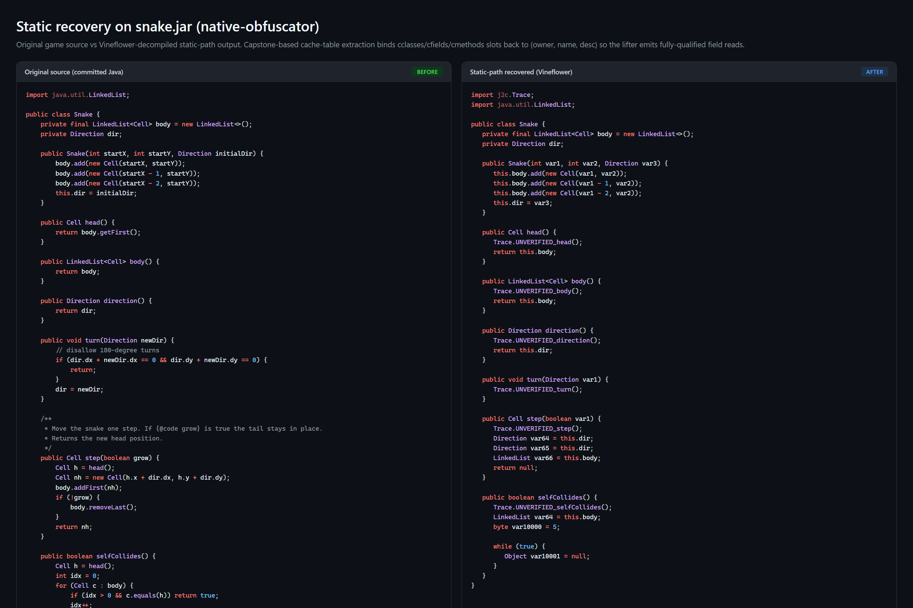
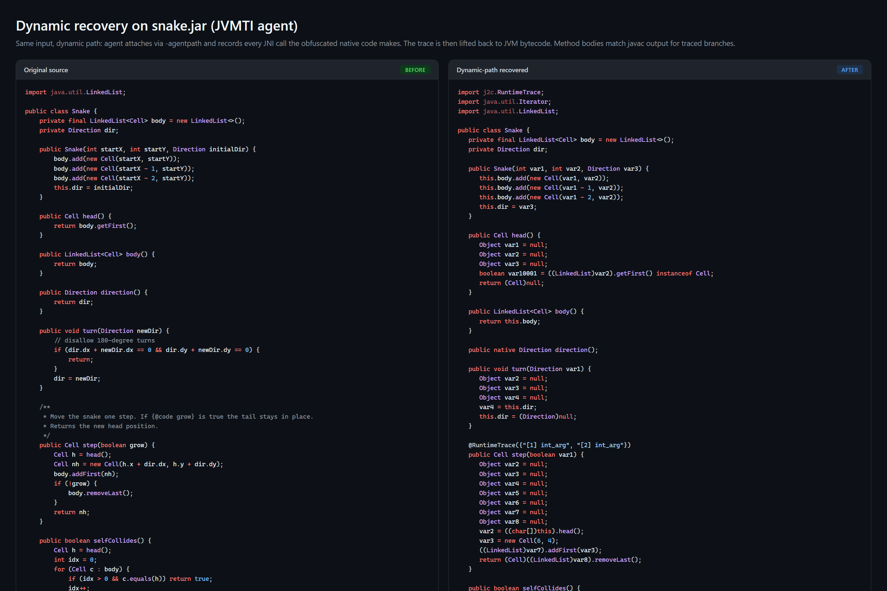
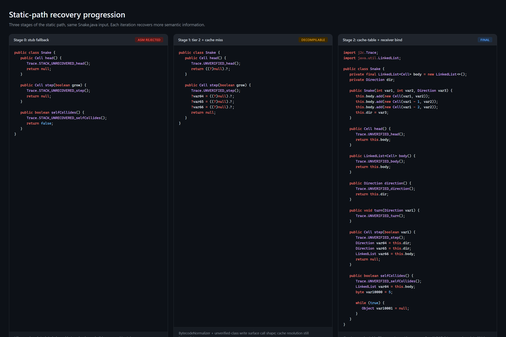
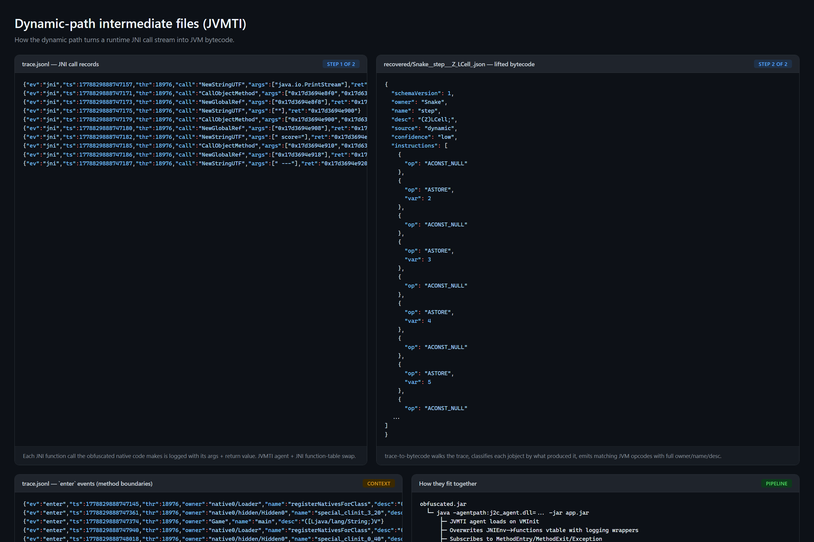
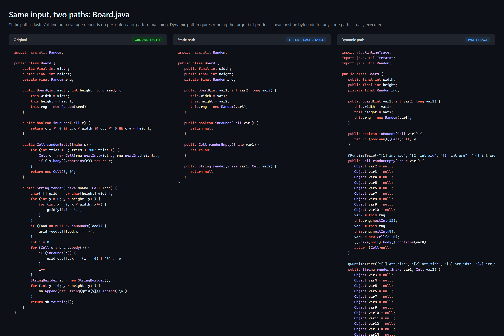
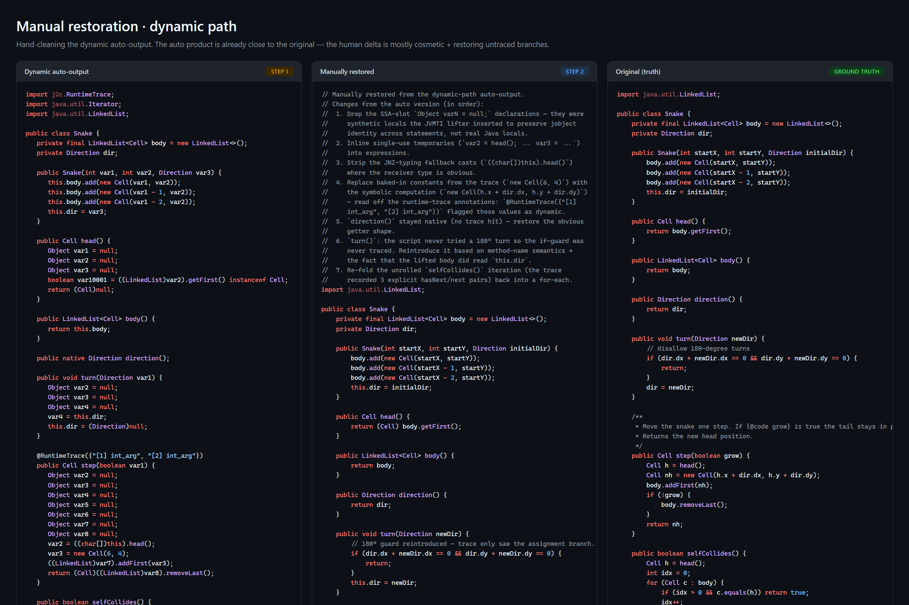
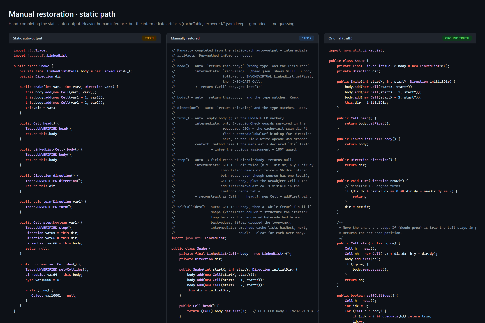

**English** | [中文](README.zh-CN.md)

# c2j-native-deobfuscator

Reverse-engineer **JNI-native-obfuscated JARs** back into readable Java
bytecode. Targets [`native-obfuscator`](https://github.com/radioegor146/native-obfuscator)
and its derivatives (e.g. j2cc) — anything that transpiles JVM bytecode
to C++ then re-invokes Java through the JNI from a packaged
`.dll` / `.so`.

Three complementary recovery paths:

| Path | Input | Approach |
|---|---|---|
| **Dynamic** | obfuscated jar + a runnable command | Attach a JVMTI agent, observe the JNI call stream, lift it back to JVM bytecode |
| **Static-lite** | transpiled jar + native blob | Discover JNI method tables, build a manifest, and emit restoration stubs without Ghidra |
| **Emulation** | obfuscated blob (no run, no Ghidra) | Run the native code under a CPU emulator + mock JNI; recover the method table, dump decrypted constants, and call methods as pure-function oracles |

The dynamic path and optional method-body plugins can emit a clean `out.jar`.
Static-lite first produces an auditable method manifest and verifier-safe stubs;
emulation can add runtime registration data, decrypted constants, and a
pure-function oracle.

License: **GPLv3**.

---

## ⭐ Recommended workflow: drive it with a coding agent

**The best way to use this project is to load the bundled skill
([`.claude/skills/j2c-deobfuscate`](.claude/skills/j2c-deobfuscate/SKILL.md))
into your favourite coding agent and let it do the work.**

This project gives you a **universal approach + tooling** for the whole
"transpile Java → C/C++ and call back via JNI" obfuscator family — but a
universal approach unavoidably needs some adaptation to each specific target
(reading a decompile, supplying per-method state, extending a harness, adding a
profile). Today's AI agents handle exactly this kind of adaptation well.

So **don't expect to just run the ready-made scripts by hand.** Without that
human/agent fix-up step, the results will be partial — not impressive. Hand the
agent the skill and the target, and let it adapt the tools to the binary.

---

## How it works

### Dynamic path

- **JVMTI agent** (`native/`, C++). Loaded via `-agentpath:`. Subscribes
  to `NativeMethodBind`, `MethodEntry`, `MethodExit`, `Exception`,
  `ExceptionCatch` JVMTI events.
- **JNI function table swap**. On `VMInit` and every `ThreadStart`, the
  agent overwrites the `JNIEnv->functions` pointer with a copy whose
  ~80 entries are redirected through logging wrappers. Each wrapper
  delegates to the original function and records the call as a JSON
  line in `trace.jsonl`. Variadic `Call*Method` flavours decode their
  `va_list` against a per-class jmethodID descriptor cache.
- **Symbol-table propagation** (`jvm/trace-to-bytecode/`). The lifter
  walks the trace, classifies each jobject reference by what produced
  it (`FindClass` → jclass, `GetMethodID` → jmethodID, etc.), and emits
  the corresponding JVM op with fully resolved owner / name / desc.
- **SSA-style synthetic locals**. Each jobject that the method reuses
  across statements gets a synthetic local slot. The lifter emits
  `DUP + ASTORE <slot>` after the producing JNI call and `ALOAD <slot>`
  at every reuse site, so the recovered bytecode keeps real reference
  identity without re-deriving the value.
- **Operand-stack balancer**. Tracks the live stack and inserts
  `POP` / `CHECKCAST` / `ACONST_NULL` corrections so the emitted
  sequence verifies under ASM `COMPUTE_FRAMES`.

### Static method discovery

- **JNI-spec table discovery** (`py/binary_introspect/`, `capstone`).
  Identifies `RegisterNatives` at vtable index 215 from instruction
  operands, then checks the ABI-specific method-table and length
  arguments. PE/Microsoft x64 and ELF/Mach-O System V are supported.
  Static `JNINativeMethod[]`, stack-built tables, shared call sites, and
  specification-defined `Java_*` exports are complementary sources.
- **Static-lite orchestration** creates `binary.json`, `manifest.json`,
  and verifier-safe stubs without a decompiler. Registration emulation can
  optionally supply runtime names and descriptors.
- **Optional Ghidra plugin** (`ghidra/scripts/DumpFromManifest.java`).
  Reads the `(class, method, fnAddr)` triples from
  `manifest.json` and runs Ghidra's p-code decompiler on each address,
  yielding a single `ghidra-dump.json` with one pseudo-C body per
  method.
- **tree-sitter-c parse** (`py/ast_matcher/`, `tree-sitter-c`). Parses
  the pseudo-C, then walks the AST with a feature-flagged driver that
  recognises `env->FnName(args)` calls (rewritten from
  Ghidra's `(**(code **)(*reg + 0xN))(...)` form), JNI helper patterns,
  and exception-check guards.
- **Optional throw-reason inference**. Some variants emit
  `"Cannot invoke X.Y.Z(args)"` strings before every would-be Java call
  for use in runtime exception messages. The lifter extracts them as
  invoke hints and uses them as fallback (owner, name, args-desc) when
  symbol tracking can't resolve a jmethodID through obfuscator helpers.
- **Profile auto-detection**. A matching variant's harvest strategy
  (per-class vs shared-dispatch), throw-reason regex, and if-guard
  skip rules all come from a :class:`Profile` selected by scanning the
  binary against built-in detectors. These heuristics are disabled under
  `generic`.

### Emulation path

- **Whole-blob emulation** (`py/native_emulate/`, `unicorn`). Maps the
  native blob (PE or ELF) into a CPU emulator and runs the obfuscated
  functions directly, under a **mock JNI environment** — a fake
  `JNIEnv`/`JavaVM` whose vtable slots trap back into Python. Because it
  *executes* the C, it observes what JNI tracing cannot: inlined
  comparisons (the check that never calls `String.equals`), the decrypted
  `<clinit>` string tables, and logic hidden behind control-flow
  flattening / MBA (the emulator runs the bytes; it doesn't try to
  structure them).
- **`recover`** — emulates the registrar (or reads `Java_*` exports /
  `JNI_OnLoad`) and captures `RegisterNatives` to list every native
  method `(name, sig, fnPtr)`. Fully automatic for native-obfuscator;
  j2cc needs the regc address (from `binary.json`).
- **`strings`** — emulates a method and dumps its decrypted string
  constants (alphabets, secrets, messages) — the string table the other
  two paths leave as indexed accesses.
- **`call`** — oracle: invoke a recovered native method as a pure
  function, feed inputs, capture outputs. Turns "read 10k lines of
  flattened MBA" into input→output probing.
- **JVM-fixed JNI ABI** is the foundation (`GetArrayLength` = vtable
  index 171, `RegisterNatives` = 215, `ExceptionCheck` = 228, …), so the
  same engine generalizes across the family. Backends: x86-64 PE/Win64
  and ELF/System-V. See [`docs/emulation-recovery.md`](docs/emulation-recovery.md).

### Shared

- **JSON pipeline**. Every stage's input + output is a versioned JSON
  artifact under `schemas/`.
- **ASM** (`org.objectweb.asm`) drives all class-file emission.
  `ClassWriter.COMPUTE_FRAMES` is the verification gate; methods that
  trip stack-imbalance get a sentinel stub body and the jar still ships.

---

## When to use which path

All three target the same input but trade off coverage versus accuracy:

| | Dynamic | Static | Emulation |
|---|---|---|---|
| **Best fit** | The JAR runs and can exercise relevant classes. | Standard JNI exports or `RegisterNatives` are visible in a supported x86-64 binary. | Logic is rewritten to pure C, registration is runtime-built, or decrypted constants are needed. |
| **Requires** | A runnable command line that exercises the transpiled classes. | JAR + native blob; no Ghidra for method lists/manifests/stubs. | Native blob + optional `unicorn`; no JVM or Ghidra. |
| **Coverage** | Only branches actually executed. | Methods whose exports/tables satisfy the structural checks; body recovery is separate. | Methods and constants reached by emulation; per-method behaviour through an oracle. |
| **Accuracy** | High for observed JNI calls. | Exact metadata for named tables/exports; ordered-address fallback for stack-built tables. | Executes the real native code, but does not automatically emit bytecode. |
| **Speed** | Target run time + agent overhead. | Fast disassembly and table decoding. | Fast when the relevant entry point is reachable. |

---

## Limitations

- **Static path correctness is best-effort.** The lifter pattern-matches
  Ghidra's pseudo-C; methods with control flow Ghidra didn't structure
  cleanly produce stack-imbalanced bytecode that `class-rebuilder`
  silently downgrades to a stub. The rest of the class still ships.
- **Dynamic path only sees branches the target actually executes.** An
  if/else where only the `if` ran is recovered as if the `else` doesn't
  exist. Loop bodies show one iteration's worth of trace; concrete
  values get baked in as LDC unless flagged dynamic by the agent.
- **Pure-native control flow / arithmetic is invisible to both paths.**
  When the obfuscator translates a computation that doesn't need a JVM
  round-trip (char-array manipulation, integer math) entirely to C++,
  no JNI calls happen, so neither dynamic tracing nor JNI-call-pattern
  matching sees anything. The recovered method body for these regions
  ends up empty or stubbed.
- **AOT-translated logic is unrecoverable.** Higher-end obfuscators
  detect Java code that doesn't require JVM cooperation (e.g.
  symmetric crypto, byte-array transformations, file I/O via
  POSIX/Win32) and emit it as straight native code instead of
  JNI-callback C++. That output has no JNI signature at all — both
  paths produce a stub for such methods. The only way back is reading
  the disassembly by hand.
- **String literals in `<clinit>`-decrypted tables remain
  unresolved.** Each obfuscated class wraps its string constants in an
  XOR/rotate table decoded at class-load time. The lifter preserves
  the indexed accesses (`Foo.a(0, 17)`) verbatim instead of substituting
  values; running the cleaned jar's `<clinit>` once + snapshotting the
  table is on the roadmap (see `docs/ROADMAP.md`).

---

## Screenshots

Auto-generated from the actual snake end-to-end fixture in
`e2e-test/snake/`. Side-by-side syntax-highlighted comparisons of
original source vs Vineflower-decompiled recovery output for both
paths. Full catalogue in [`screenshots/README.md`](screenshots/README.md).

**Static path — Snake.java end-to-end**



Original snake source vs Vineflower-decompiled static-path output.
Capstone-based cache-table extraction binds every cclasses/cfields/
cmethods slot back to `(owner, name, desc)`, then the lifter
pre-binds JNI `param_2` to JVM local 0 so receivers render as `this`.

**Dynamic path — Snake.java end-to-end**



Same input via the JVMTI agent: every JNI call the obfuscated native
code makes gets logged and lifted back to JVM bytecode. Bodies match
javac output for the branches actually executed.

**Static-path progression**



Three stages of the static path on the same input — stub fallback,
tier-2 unverified write, and the final state with cache-table + receiver
binding. Each iteration adds another layer of semantic recovery.

**JVMTI dynamic-path intermediates**



How the dynamic path turns a runtime JNI-call stream into JVM bytecode:
the agent's `trace.jsonl` records, the per-method `recovered/*.json`
lifted bytecode artifact, and the connecting pipeline.

**Two paths, same input: Board.java**



The static path is faster and works offline but coverage depends on
per-obfuscator pattern matching. The dynamic path requires running the
target but produces near-pristine bytecode for any code path that
actually executes during the trace.

**Manual restoration · dynamic path**



What a 10–15 minute hand pass over the dynamic auto-output looks like:
drop the SSA-slot `Object varN = null;` declarations, inline single-use
temporaries, replace trace-baked constants with the symbolic form, and
restore the branches the trace never executed. Workflow:
[`docs/manual-restoration.md`](docs/manual-restoration.md).

**Manual restoration · static path**



Heavier human inference, but the intermediate artifacts keep it
grounded: `recovered/*.json` records the opcode sequence the lifter
extracted, and `manifest.json.cacheTable` resolves every `?.?` to a
real `(owner, name, desc)` triple — even when the decompiler couldn't
render them.

---

## Quick start

### One-time build

```bash
# JVM modules
cd jvm && ./gradlew installDist

# Python workspace
cd py && uv sync --all-packages

# Native agent (only needed for the dynamic path)
cd native && JDK_HOME="$JAVA_HOME" bash build.sh

# Emulation path
cd py && .venv/Scripts/python -m pip install unicorn   # or your venv's pip
```

### Dynamic recovery (preferred when the jar runs in your environment)

```bash
python -m j2c_dumper_cli.main recover \
    path/to/obfuscated.jar \
    -o path/to/clean.jar \
    --run-cmd "java -jar path/to/obfuscated.jar"
```

This chains:

1. `parse-jar`         → `classes.json`
2. `inspect-binary`    (auto-extracts the native blob from the jar)
3. `merge-manifest`    → `manifest.json`
4. `dynamic-trace`     runs the target with the JVMTI agent → `trace.jsonl`
5. `trace-to-bc`       lifts to `recovered/*.json`
6. `rebuild`           emits the loader-stripped output jar

### Generic static-lite recovery (no Ghidra)

```bash
python -m j2c_dumper_cli.main static-lite in.jar \
    --lib natives.bin --profile generic -o static-lite/

# Optional: capture runtime-built RegisterNatives tables too
python -m j2c_dumper_cli.main inspect-binary natives.bin \
    --profile generic --emulate-registration -o binary.json
```

This produces `binary.json`, `manifest.json`, and `recovered/*.json` stubs.
See [`docs/generic-recovery.md`](docs/generic-recovery.md).

For optional pseudo-C method-body lifting, run Ghidra after static-lite:

```bash
<GHIDRA>/support/analyzeHeadless.bat <project-dir> proj \
    -import natives.bin \
    -scriptPath <repo>/ghidra/scripts \
    -postScript DumpFromManifest.java static-lite/manifest.json ghidra-dump.json

python -m ast_matcher.cli ghidra-dump.json \
    --manifest static-lite/manifest.json -o static-lite/recovered/
python -m j2c_dumper_cli.main rebuild --input in.jar \
    --recovered static-lite/recovered/ \
    --manifest static-lite/manifest.json -o out.jar
```

`manifest.json` preserves `analysis.profile` from `binary.json`. When the
`ast_matcher` command omits `--profile`, it uses that recorded profile; an
explicit `--profile` overrides it, and artifacts without one remain on the
conservative `generic` profile.

### Emulation recovery (no JVM, no Ghidra — for C-rewritten logic / decrypted constants)

```bash
# list native methods (entry points auto-discovered)
python -m j2c_dumper_cli.main emulate natives.bin --operation recover \
    --binary-json binary.json

# dump a function's decrypted string constants (alphabet, secret, messages)
python -m j2c_dumper_cli.main emulate natives.bin --operation strings --fn 0x<addr>

# call a native method as a pure function (oracle)
python -m j2c_dumper_cli.main emulate natives.bin --operation call --fn 0x<addr> \
    --arg-bytes "input" --static "v=@alphabet.txt"
```

Full walkthrough: [`docs/emulation-recovery.md`](docs/emulation-recovery.md);
command reference + verified matrix: [`py/native_emulate/README.md`](py/native_emulate/README.md).

### Stage-by-stage

Every stage has its own subcommand under `j2c-dumper`; see
`python -m j2c_dumper_cli.main --help` for the full list.

---

## Generality

`generic` is the default fallback and depends on JNI specification facts:

- `RegisterNatives` vtable index 215;
- ABI-specific argument registers for Microsoft x64, System V x86-64,
  AArch64 AAPCS64 (`x2` for the method table, `w3`/`x3` for `nMethods`), and
  32-bit ARM AAPCS32 (`r2` for the method table, `r3` for `nMethods`);
- valid `JNINativeMethod` names/descriptors and executable function pointers;
- specification-defined `Java_*` exports;
- optional registration capture through binary emulation.

It does not enable throw-message regexes, decompiler-output rewrites,
cache-table naming assumptions, or exception/cache guard skip patterns.
Matching variant profiles can opt into those features. Ghidra scripts are
optional plugins for method-body lifting and are not part of generic method
discovery.

Generic discovery is proven by committed fixtures across all three x86-64
object formats (ELF, PE, Mach-O) and both registration families (a
`RegisterNatives` static table and `Java_*` export names), including a
symbol-stripped ELF, an **AArch64** ELF (`adrp`/`add` table addressing, JNI
dispatch reached through the `x16` veneer register), a **Mach-O arm64** dylib
(`format=MachO`/`arch=aarch64` with a `_Java_*` export, and the static table
decoded through the compact single-`adr` table addressing when the host
Capstone can decode AArch64), a **32-bit ARM** ELF (`format=ELF`/`arch=arm`
with a `Java_*` export, and the static table decoded through the
literal-pool + `add r2, pc, r2` table addressing and the `ip` veneer register
when the host Capstone can decode ARM), and **section-header-removed ELF**
images recovered through a `PT_LOAD` program-header fallback. See the
proven/unproven matrix in
[`docs/generic-recovery.md`](docs/generic-recovery.md). This remains a
development path: it is not promoted to the default `recover` flow, and it does
not claim to restore method bytecode.

Generic recovery is intentionally bounded: unsupported ABIs, nonstandard or
encrypted registration that emulation cannot reach, and custom method-body
layouts still need a profile/backend extension. See
[`docs/generic-recovery.md`](docs/generic-recovery.md) and
[`docs/adding-obfuscator-profile.md`](docs/adding-obfuscator-profile.md).

Optional lifter heuristics remain individually switchable:

```bash
python -m ast_matcher.cli ghidra-dump.json -o recovered/ \
    --disable use_throw_reason_invoke_hints \
    --disable skip_native_exception_guards
python -m ast_matcher.cli --list-flags
```

---

## Repository layout

```
├── jvm/                        Kotlin/ASM modules (Gradle multi-project)
│   ├── jar-parser/             input.jar  → classes.json
│   ├── trace-to-bytecode/      manifest + trace.jsonl → recovered/*.json
│   ├── class-rebuilder/        input.jar + recovered/ → output.jar
│   └── common/                 shared schema types
├── native/                     C++ JVMTI agent (zig c++ build)
├── ghidra/scripts/             Ghidra headless scripts (Java)
├── py/                         Python modules (uv workspace)
│   ├── jar_parser/             —
│   ├── binary_introspect/      .dll / .so / natives.bin  → binary.json
│   │   ├── arch/               per-arch / ABI implementations
│   │   ├── jni_tables.py       RegisterNatives table discovery
│   │   ├── profile.py          obfuscator-variant profiles
│   │   └── stub_recovery.py    synthesize stub bodies for unrecovered methods
│   ├── manifest_merge/         classes.json + binary.json → manifest.json
│   ├── ast_matcher/            pseudo-C → JVM bytecode
│   │   └── lifter/             driver + per-feature submodules
│   ├── j2c_dumper_cli/         top-level CLI orchestrator
│   ├── native_emulate/         emulation path: j2c_emu.py (Unicorn + mock JNI)
│   └── snippet_importer/       (optional) native-obfuscator cppsnippets ingestor
├── .claude/skills/             j2c-deobfuscate skill (agent playbook)
├── docs/                       ARCHITECTURE.md, ROADMAP.md, profile guide, …
├── schemas/                    JSON Schema for every artifact
└── tests/                      e2e fixtures and pipeline tests
```

---

## Documentation

- [ARCHITECTURE.md](docs/ARCHITECTURE.md) — module boundaries, pipeline,
  artifact schemas, extension points
- [emulation-recovery.md](docs/emulation-recovery.md) — emulation path how-to
  (+ command reference in [`py/native_emulate/README.md`](py/native_emulate/README.md))
- [generic-recovery.md](docs/generic-recovery.md) — Ghidra-free method discovery,
  manifests, stubs, and optional emulation
- [manual-restoration.md](docs/manual-restoration.md) — hand-cleaning recovered output
- [ROADMAP.md](docs/ROADMAP.md) — known limitations and planned work
- [adding-obfuscator-profile.md](docs/adding-obfuscator-profile.md) — how
  to register a new obfuscator variant
- [static-reverse-approach.md](docs/static-reverse-approach.md) — design
  notes for the Ghidra-based path
- [`.claude/skills/j2c-deobfuscate`](.claude/skills/j2c-deobfuscate/SKILL.md) —
  the agent playbook (load this into your coding agent)

---

## License

Released under **GPL v3**. See [LICENSE](LICENSE).
