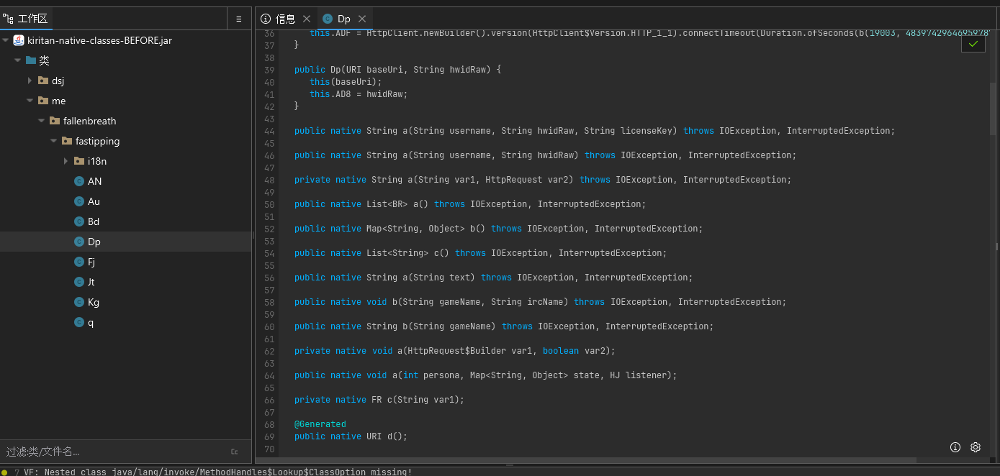

[English](README.md) | **中文**

# c2j-native-deobfuscator

把被 **JNI native 混淆器** 处理过的 JAR 还原回可读的 Java 字节码。
目标对象是 [`native-obfuscator`](https://github.com/radioegor146/native-obfuscator)
及其衍生工具（如 j2cc）—— 凡是把 JVM 字节码翻成 C++、再通过 JNI 从打包进
JAR 的 `.dll` / `.so` 回调 Java 的混淆方案，都在覆盖范围内。

提供两条互补的恢复路径：

| 路径 | 输入 | 思路 |
|---|---|---|
| **动态** | 混淆后的 JAR + 一条可运行的命令 | 加载 JVMTI agent，观察 JNI 调用流，把它重新拼回 JVM 字节码 |
| **静态** | 混淆后的 JAR + Ghidra | 在 native blob 里定位 JNI method table，逐函数反编译，把 pseudo-C 抬升回 JVM 字节码 |

任一路径都会输出一个干净的 `out.jar`：原先的 native 方法现在拥有真实的字节码方法体，loader / native blob 资源条目被剥离。

协议：**GPLv3**。

---

## 效果展示

> 占位项；图片放在 [`screenshots/showcase/`](screenshots/showcase/) 下。
> 完整目录见 [`screenshots/README.md`](screenshots/README.md)。

**反编译器视图（IntelliJ / CFR）**

| 还原前 | 还原后 |
|---|---|
|  |  |
| native 方法体为空，loader 类仍在 | 方法体已重建，loader 类被剥离 |

**`javap -c -p` 单方法对比**

| 还原前 | 还原后 |
|---|---|
|  |  |
| 仅有 `native` 修饰符，没有 Code 属性 | 真实的 Code 属性 + opcode 序列 |

**端到端运行 & Ghidra pseudo-C**

| 恢复流水线 | Ghidra pseudo-C |
|---|---|
|  |  |
| 动态路径的逐阶段输出 | 静态路径抬升器的真实输入 |

---

## 技术栈

### 动态路径

- **JVMTI agent**（`native/`，C++）。通过 `-agentpath:` 加载，订阅
  `NativeMethodBind`、`MethodEntry`、`MethodExit`、`Exception`、
  `ExceptionCatch` 等 JVMTI 事件。
- **JNI 函数表替换**。在 `VMInit` 和每个 `ThreadStart` 时，把
  `JNIEnv->functions` 指针整体换成一份代理表。代理表里约 80 个槽位都被
  重定向到记录调用日志的 wrapper，wrapper 在转发到原函数前把这次调用
  写成一行 JSON 进 `trace.jsonl`。`Call*Method` 这类变参形式按
  jmethodID 缓存的 descriptor 解析 `va_list`。
- **符号传播**（`jvm/trace-to-bytecode/`）。抬升器逐条扫描 trace，根据
  每个 jobject 的来源给它打类型标签（`FindClass` → jclass，
  `GetMethodID` → jmethodID，等等），再按完整的 owner / name / desc 信息
  发射对应的 JVM opcode。
- **SSA 风格的合成 local**。被多次复用的 jobject 会分配一个合成槽位，
  在产生它的 JNI 调用后追加 `DUP + ASTORE <slot>`，每个复用点改用
  `ALOAD <slot>`。这样还原出的字节码保留了真实的引用同一性，不必重复
  推导。
- **操作数栈平衡器**。跟踪当前栈状态，在必要位置插入 `POP` / `CHECKCAST`
  / `ACONST_NULL`，让最终的字节码可以通过 ASM 的
  `COMPUTE_FRAMES` 校验。

### 静态路径

- **反汇编层的 native 表发现**（`py/binary_introspect/`，`capstone`）。
  扫描 native blob 的可执行节，定位所有
  `call qword ptr [reg + 0x6B8]`（`RegisterNatives` 在 JNI vtable 中的偏移）
  调用点，往前回扫 PC 相对的 `lea`（指向 `.text`，即栈上构造的
  `JNINativeMethod[]` 里的函数指针）以及最近的
  `mov <nMethods-reg>, imm`（表长度）。
- **Ghidra 反编译器**（`ghidra/scripts/DumpFromManifest.java`，Ghidra
  Headless）。读取 `manifest.json` 中的 `(class, method, fnAddr)`，对每个
  地址跑一次 p-code 反编译，结果汇总到 `ghidra-dump.json`，每个方法对应
  一段 pseudo-C。
- **tree-sitter-c AST 解析**（`py/ast_matcher/`，`tree-sitter-c`）。把
  Ghidra 输出的 pseudo-C 解析成 AST，再由按 feature flag 控制的 driver
  识别 `env->FnName(args)` 形式的 JNI 调用（这是从 Ghidra 的
  `(**(code **)(*reg + 0xN))(...)` 形式改写来的）、JNI helper 模式以及
  异常检查守卫。
- **异常文案推断**。native-obfuscator 家族会在每次潜在 Java 调用前生成
  `"Cannot invoke X.Y.Z(args)"` 字符串以备运行时抛异常用。当符号跟踪
  穿不过混淆器自己的 helper 时，抬升器把这些字符串解析成 invoke hint
  做兜底的 `(owner, name, args-desc)` 来源。
- **Profile 自动探测**。当前混淆器变体的采集策略（每类一张表
  vs 共享 dispatch）、异常文案正则、if-guard 跳过规则等都来自一个
  `Profile`，由二进制扫描出来的探测器选定。

### 共用部分

- **JSON 管线**。每个阶段的输入和输出都是 `schemas/` 下带版本号的 JSON
  artifact。
- **ASM**（`org.objectweb.asm`）负责所有 class 文件发射。
  `ClassWriter.COMPUTE_FRAMES` 是验证关；栈不平衡而未通过的方法会被替换
  成 sentinel stub，JAR 仍然可以产出。

---

## 适用对象

两条路径输入相同，但在覆盖率和准确性上取舍不同：

| | 动态 | 静态 |
|---|---|---|
| **适合的场景** | 二进制被加壳 / 虚拟机保护 / 反调试 —— JVMTI agent 工作在 Java 侧，native 层的保护不影响它的可见性。 | 二进制未经额外保护（例如直接 native-obfuscator + zig c++ 输出），Ghidra 能直接反编译每个 `fnAddr`。 |
| **要求** | 一条可执行的命令（`java -jar ...`），并且能跑到目标类。 | 安装了 Ghidra 11.x。 |
| **覆盖率** | 只覆盖实际被执行到的分支；从未被调用的方法完全采集不到。 | 通过 `RegisterNatives` 注册的所有方法，无论运行时是否被触发。 |
| **准确性** | 高 —— 每条 opcode 都对应 JVM 实际观察到的 JNI 调用。 | best-effort —— 抬升器靠模式匹配，无法保持栈平衡时退化为 stub。 |
| **耗时** | 受目标本身执行时长 + agent 开销限制。 | 受 Ghidra 自动分析限制（1 MB 量级的 blob 通常需要数分钟）。 |

---

## 局限性

- **静态路径不保证准确性。** 抬升器是在 Ghidra 的 pseudo-C 上做模式
  匹配；Ghidra 没能干净结构化的控制流会产出栈不平衡的字节码，被
  `class-rebuilder` 静默降级成 stub。整个类的其他方法仍然能正常输出。
- **动态路径只能看到运行时实际触达的分支。** 一个 if/else，运行时只走
  if 的话，恢复出来的字节码里 else 就不存在；循环体只能看到一次迭代
  的痕迹；除非 agent 把某个值标记为动态值，否则它会被烧成 LDC 常量。
- **纯 native 控制流 / 算术运算对两条路径都不可见。** 当混淆器把一段
  完全不需要 JVM 协作的运算（字符数组操作、整型计算等）整体翻成 C++
  时，没有任何 JNI 调用发生，动态采不到，静态匹配 JNI 模式也匹配不到，
  这一段的方法体最终会是空或 stub。
- **AOT 转译过的逻辑无法恢复。** 一些高级混淆器会识别出"不依赖 JVM"
  的 Java 代码（例如对称加密、字节数组变换、走 POSIX / Win32 的文件
  操作），直接发射成纯 native 代码而不是 JNI-callback 形式的 C++。
  这种输出里完全没有 JNI 签名 —— 两条路径都只能给一个 stub，唯一的
  办法是人工读汇编。
- **`<clinit>` 解密的字符串表暂未还原。** 混淆器普遍会把每个类的字符串
  常量包成一张 XOR / 移位表，在类加载时解码。抬升器目前原样保留
  `Foo.a(0, 17)` 这样的下标访问，不替换具体值；规划中的做法是用清理后
  的 JAR 跑一次 `<clinit>` 把表 dump 出来再回填（详见 `docs/ROADMAP.md`）。

---

## Quick start

### 一次性构建

```bash
# JVM 模块
cd jvm && ./gradlew installDist

# Python 工作区
cd py && uv sync --all-packages

# Native agent（仅动态路径需要）
cd native && JDK_HOME="$JAVA_HOME" bash build.sh
```

### 动态恢复（首选，前提是目标在你环境里能跑）

```bash
python -m j2c_dumper_cli.main recover \
    path/to/obfuscated.jar \
    -o path/to/clean.jar \
    --run-cmd "java -jar path/to/obfuscated.jar"
```

依次执行：

1. `parse-jar`         → `classes.json`
2. `inspect-binary`    （从 JAR 自动抽出 native blob）
3. `merge-manifest`    → `manifest.json`
4. `dynamic-trace`     带 JVMTI agent 跑目标 → `trace.jsonl`
5. `trace-to-bc`       抬升到 `recovered/*.json`
6. `rebuild`           输出 loader 已剥离的最终 JAR

### 静态恢复（目标跑不起来时使用 —— 需要 Ghidra）

```bash
# 1. 解析 jar + 内省二进制（不需要 --run-cmd）
python -m j2c_dumper_cli.main parse-jar      in.jar      -o classes.json
python -m j2c_dumper_cli.main inspect-binary natives.bin -o binary.json
python -m j2c_dumper_cli.main merge-manifest classes.json binary.json -o manifest.json

# 2. 用 Ghidra Headless 跑 native blob
<GHIDRA>/support/analyzeHeadless.bat <project-dir> proj \
    -import natives.bin \
    -scriptPath <repo>/ghidra/scripts \
    -postScript DumpFromManifest.java manifest.json ghidra-dump.json

# 3. pseudo-C 抬升到字节码 + 重建 JAR
python -m ast_matcher.cli ghidra-dump.json --manifest manifest.json -o recovered/
python -m j2c_dumper_cli.main rebuild --input in.jar --recovered recovered/ \
    --manifest manifest.json -o out.jar
```

### 分阶段执行

每个阶段都有独立的子命令，详见
`python -m j2c_dumper_cli.main --help`。

---

## 通用性

项目预置了两个会自动探测的混淆器 **Profile**：

- `native_obfuscator` — radioegor146/native-obfuscator 及兼容衍生版本
- `j2cc`              — me.x150.j2cc（单一共享 `initClass` dispatch）
- `generic`           — 无 Profile 命中时的兜底，只依赖 JNI 规范

自定义变体可以以新 Profile 形式接入，不需要改主流程。
参见 [`docs/adding-obfuscator-profile.md`](docs/adding-obfuscator-profile.md)。

静态路径的抬升器把每个推断 / 匹配步骤都暴露成 feature flag（异常文案
hint、ExceptionCheck-guard 跳过、符号表跟踪、查表解析等等）。哪个 flag
对当前二进制误判，就把它关掉：

```bash
python -m ast_matcher.cli ghidra-dump.json -o recovered/ \
    --disable use_throw_reason_invoke_hints \
    --disable skip_native_exception_guards
python -m ast_matcher.cli --list-flags
```

---

## 仓库结构

```
├── jvm/                        Kotlin/ASM 模块（Gradle 多项目）
│   ├── jar-parser/             input.jar  → classes.json
│   ├── trace-to-bytecode/      manifest + trace.jsonl → recovered/*.json
│   ├── class-rebuilder/        input.jar + recovered/ → output.jar
│   └── common/                 公共 schema 类型
├── native/                     C++ JVMTI agent（zig c++ 构建）
├── ghidra/scripts/             Ghidra Headless 脚本（Java）
├── py/                         Python 模块（uv workspace）
│   ├── jar_parser/             —
│   ├── binary_introspect/      .dll / .so / natives.bin  → binary.json
│   │   ├── arch/               按架构 / ABI 的实现
│   │   ├── jni_tables.py       RegisterNatives 表发现
│   │   ├── profile.py          混淆器变体 Profile
│   │   └── stub_recovery.py    未恢复方法的 stub 合成
│   ├── manifest_merge/         classes.json + binary.json → manifest.json
│   ├── ast_matcher/            pseudo-C → JVM 字节码
│   │   └── lifter/             driver + 各 feature 子模块
│   ├── j2c_dumper_cli/         顶层 CLI 编排器
│   └── snippet_importer/       （可选）native-obfuscator cppsnippets 导入器
├── docs/                       ARCHITECTURE.md、ROADMAP.md、profile 指南 …
├── schemas/                    每种 artifact 的 JSON Schema
└── tests/                      端到端 fixture 与管线测试
```

---

## 文档

- [ARCHITECTURE.md](docs/ARCHITECTURE.md) — 模块边界、管线、artifact schema、扩展点
- [ROADMAP.md](docs/ROADMAP.md) — 已知限制和计划工作
- [adding-obfuscator-profile.md](docs/adding-obfuscator-profile.md) — 如何注册新混淆器变体
- [static-reverse-approach.md](docs/static-reverse-approach.md) — 基于 Ghidra 的静态路径设计笔记

---

## License

以 **GPL v3** 发布。详见 [LICENSE](LICENSE)。
